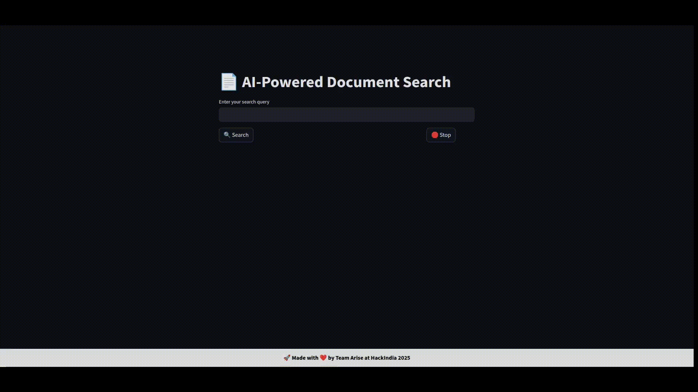

# HackIndia-Spark-2-2025---Team-Arise
📄 AI-Powered Document Search & Retrieval Assistant
🚀 HackIndia Spark 2 - 2025 | Team Arise
🔍 Overview

This AI-powered document search assistant allows users to quickly find, summarize, and retrieve documents using natural language queries. It ensures fast, private, and accurate search results by leveraging local AI models instead of relying on cloud-based solutions.
🔥 Features

✅ AI-Powered Smart Search – Finds documents based on context, not just keywords.
✅ Instant Summaries – Extracts key insights from lengthy documents.
✅ Fast & Secure – Runs fully offline, ensuring data privacy.
✅ Flexible AI Model Support – Currently uses Gemma 2B via Ollama, but can integrate any AI model/API.
✅ Multi-Format Compatibility – Supports PDF, Word (.docx), PPT, and text files.
 

## 🔥 Features  
- **Smart Search**: Understands natural language queries, not just keywords.  
- **AI-Powered Summaries**: Extracts key insights from lengthy documents.i
- File Upload Support (New!): Now you can upload your own text files, and they will be included in search results.
- **Context-Aware Recommendations**: Suggests related documents.  
- **Multi-Format Support**: Works with PDFs, Word docs, PPTs, and text files.  
- **Fast & Secure**: Ensures quick retrieval while keeping data private.  

# 🛠️ Tech Stack

- Backend: Python + Flask
- Frontend: Streamlit
- AI Model: Gemma 2B (via Ollama)
- Storage: Local Document Repository
- Security: Fully offline AI processing (No external API calls)

## 🛠️ Installation  
1. Clone the repository:  
   ```sh
   git clone https://github.com/Nxrnoob/HackIndia-Spark-2-2025---Team-Arise.git
   cd HackIndia-Spark-2-2025---Team-Arise

2. Install dependencies:
   (virtual environment recommended)     

    ```sh
   pip install -r requirements.txt

3. Install ollama as per you Operating system.
    ```sh
   ollama run gemma2:2b

   Use any desired model of your choice and make sure to replace the current one in the code.

### Note: Make sure to create a folder named Document or Any desired name (needs change in code) and paste all the documents in it.

3. Run the assistant:

    ```sh
   python main.py

## Demo 
   
   


## 🧠 How It Works

- Extracts text from PDFs, Word, and PowerPoint files.
- Uses AI (Gemma2:2B via Ollama) to rank document relevance based on meaning, not word frequency.
- Generates AI-powered summaries tailored to the search query.
- Any Ollama-supported model can be used, making it flexible and customizable.

## 📂 Supported Formats

✔️ PDFs
✔️ Word Documents (.docx)
✔️ PowerPoint Slides (.pptx)
✔️ Text Files (.txt)

## 🤖 AI Integration & Future Scalability

This project currently runs Gemma 2B via Ollama, but it is designed to be modular, allowing integration with:
✔️ Other LLMs (LLaMA, Mistral, GPT models)
✔️ External AI APIs (if needed in future)
✔️ Hybrid AI Deployment (Local & Cloud)

## 🔒 Security First! – Runs fully offline, ensuring data privacy without external API calls.
Made with ❤️ by Team Arise
🎯 HackIndia Spark 2 - 2025
